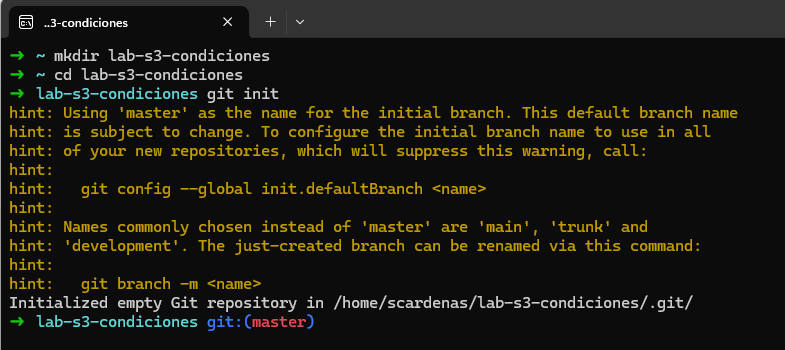
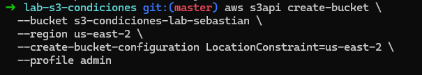
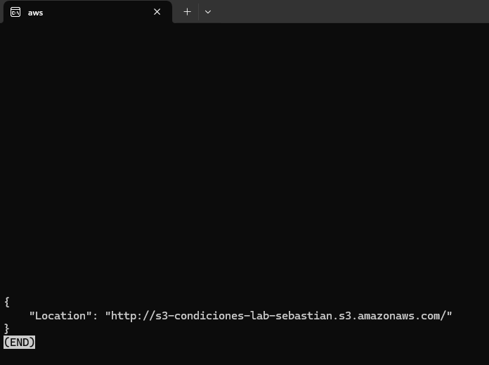
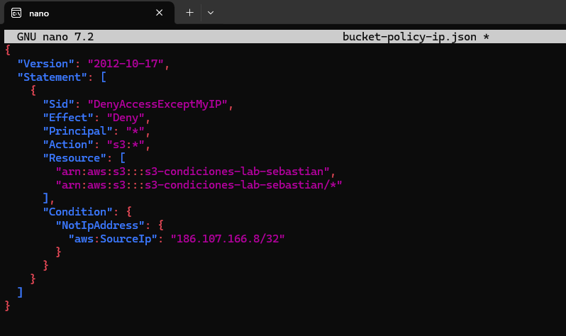
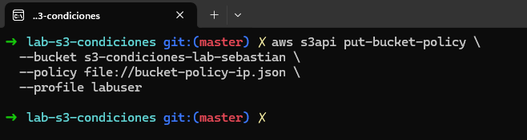
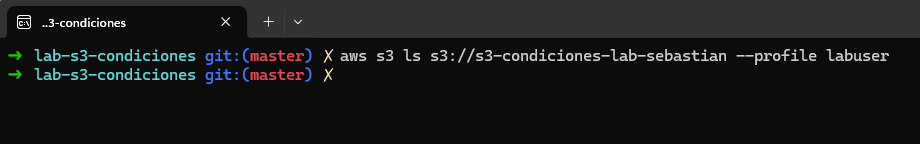
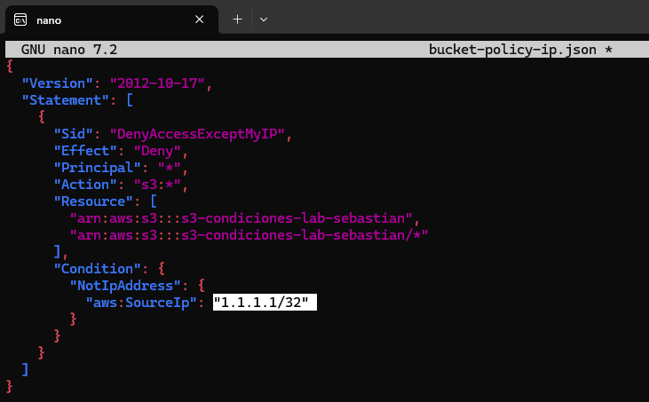
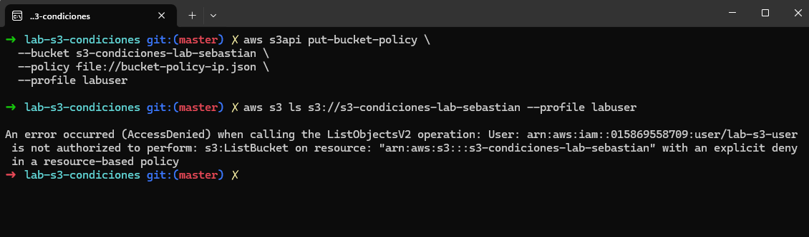

# 🛡️ Laboratorio: Control de acceso a bucket S3 por IP

Este laboratorio demuestra cómo aplicar una política de control de acceso a un bucket de Amazon S3 basada en condiciones específicas, en este caso por dirección IP. Se documentan tanto accesos permitidos como denegados, y se valida la efectividad de las políticas de seguridad aplicadas.

---

## 🎯 Objetivo

- Crear un bucket S3.
- Aplicar una política que solo permita acceso desde una IP específica.
- Validar el comportamiento con acceso permitido y denegado.

---

## 🧪 Requisitos

- AWS CLI configurado.
- Un perfil IAM con permisos para administrar S3 (`labuser` en este caso).
- Git (para documentación del laboratorio).

---

## 🗂️ Estructura del laboratorio

### Paso 0: Inicialización del repositorio Git

```bash
mkdir lab-s3-condiciones
cd lab-s3-condiciones
git init
```


---

### Paso 1: Crear bucket S3

```bash
aws s3api create-bucket \
  --bucket s3-condiciones-lab-sebastian \
  --region us-east-2 \
  --create-bucket-configuration LocationConstraint=us-east-2 \
  --profile labuser
```




---

### Paso 2: Crear política de restricción por IP

Se crea el archivo `bucket-policy-ip.json` con la siguiente política:

```json
{
  "Version": "2012-10-17",
  "Statement": [
    {
      "Sid": "DenyAccessExceptMyIP",
      "Effect": "Deny",
      "Principal": "*",
      "Action": "s3:*",
      "Resource": [
        "arn:aws:s3:::s3-condiciones-lab-sebastian",
        "arn:aws:s3:::s3-condiciones-lab-sebastian/*"
      ],
      "Condition": {
        "NotIpAddress": {
          "aws:SourceIp": "IP/32"
        }
      }
    }
  ]
}
```



---

### Paso 3: Aplicar política al bucket

```bash
aws s3api put-bucket-policy \
  --bucket s3-condiciones-lab-sebastian \
  --policy file://bucket-policy-ip.json \
  --profile labuser
```



---

### Paso 4: Validar acceso desde IP permitida

```bash
aws s3 ls s3://s3-condiciones-lab-sebastian --profile labuser
```



---

### Paso 5: Cambiar la política para denegar acceso

Se modifica el archivo `bucket-policy-ip.json` para permitir una IP falsa (simulación de IP no autorizada):

```json
"aws:SourceIp": "8.8.8.8/32"
```



---

### Paso 6: Validar denegación de acceso

```bash
aws s3 ls s3://s3-condiciones-lab-sebastian --profile labuser
```



---

## ✅ Conclusión

Este laboratorio demostró cómo utilizar políticas con condiciones en S3 para permitir o denegar acceso dinámicamente según la IP del cliente. Estas medidas son clave para limitar el acceso a datos sensibles en la nube.
